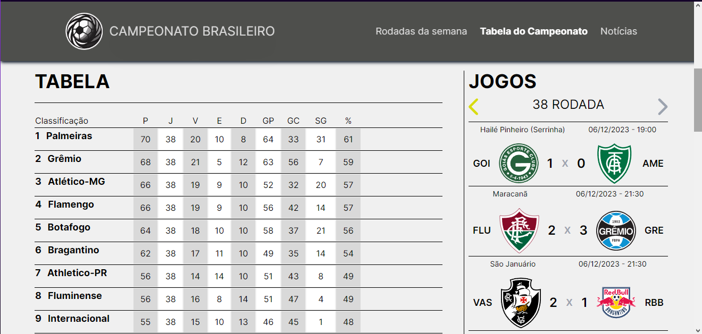
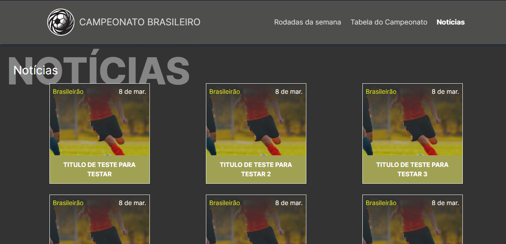

# Tabela do Brasileirão

Esse projeto busca apresentar a classificação do campeonato brasileiro, bem como jogos recentes e notícias relacionadas ao assunto.

## 📖 Indice

<ul>

<li>
    <h3><a href="#status">Status</a></h3>
</li>
<li>
    <h3><a href="#aplicacao">Aplicação</a></h3>      
</li>
<li>
    <h3><a href="#instalacao">Instalação</a></h3>
</li>
<li>
    <h3><a href="#tecnologias">Tecnologias</a></h3>
</li>
<li>
    <h3><a href="#autores">Autores</a></h3>
</li>

<ul>

<section id="status">
<h2>Status</h2>
  
<h3>✔Concluído</h3>
</section>

<section id="aplicacao">
  <h2>📱 Aplicação</h2>
  

</section>

  
  
  

<section id="instalacao">
 <h2>⬇ Instalação</h2>
  
  Para fazer a instalação do projeto, basta seguir as etapas a seguir
  
  <h3>Clonar o projeto</h3>
  
  ```bash
    git init
    git clone https://github.com/G-Toti/Trabalho-Final-Byron.git
    cd 'Trabalho Final Byron'
  ```
  
  <h3>Inicializar o projeto</h3>
  
  Primero será necessário iniciar o json server
  
  ```cmd
    cd trabalho-final-back
    npx json-server ./database/bd_campeonatos.json
  ```
  
  Depois inicializar o strapi
  
  ```cmd
    cd trabalho-final-back
    npm run develop
  ```
  
  Por fim iniciar o front
  
  ```cmd
    cd trabalho-final-front
    npm run dev
  ```
  
  <h3>⚠ Recomenda-se utilizar um console para cada inicialização</h3>
</section>

<section id="tecnologias">
  <h2>🖥 Teconologias</h2>
  
  - [JSON-SERVER](https://github.com/typicode/json-server)
  - [NEXT.JS](https://nextjs.org/docs)
  - [STRAPI](https://docs.strapi.io/dev-docs/intro)
  - [NODE.JS](https://nodejs.org/en)
  - [AXIOS](https://axios-http.com/ptbr/docs/intro)
  - [EMBLA CAROUSEL](https://www.embla-carousel.com/get-started/)
  - [FONT AWSOME](https://fontawesome.com)
</section>

<section id="autores">
  <h2>👨‍🎨 Autores</h2>
  
  <table>
    <tbody>
      <tr>
        <td align="center" valign="top">
          <a href="https://github.com/Tiago-htm">
            
            <br/>
            <b>Tiago</b>
          </a>
        </td>
        <td align="center" valign="top">
          <a href="https://github.com/G-Toti">
            
            <br/>
            <b>Gabriel Toti</b>
          </a>
        </td>
      </tr>
    </tbody>
  </table>
</section>
